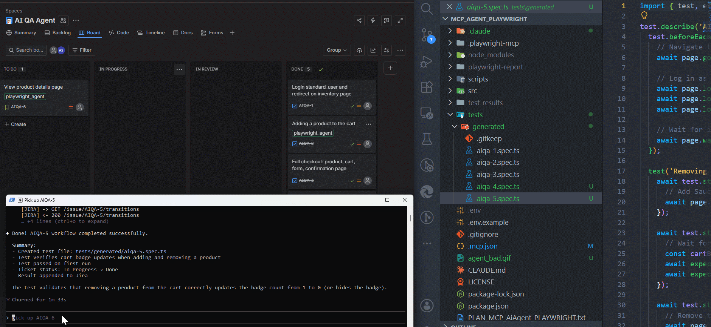
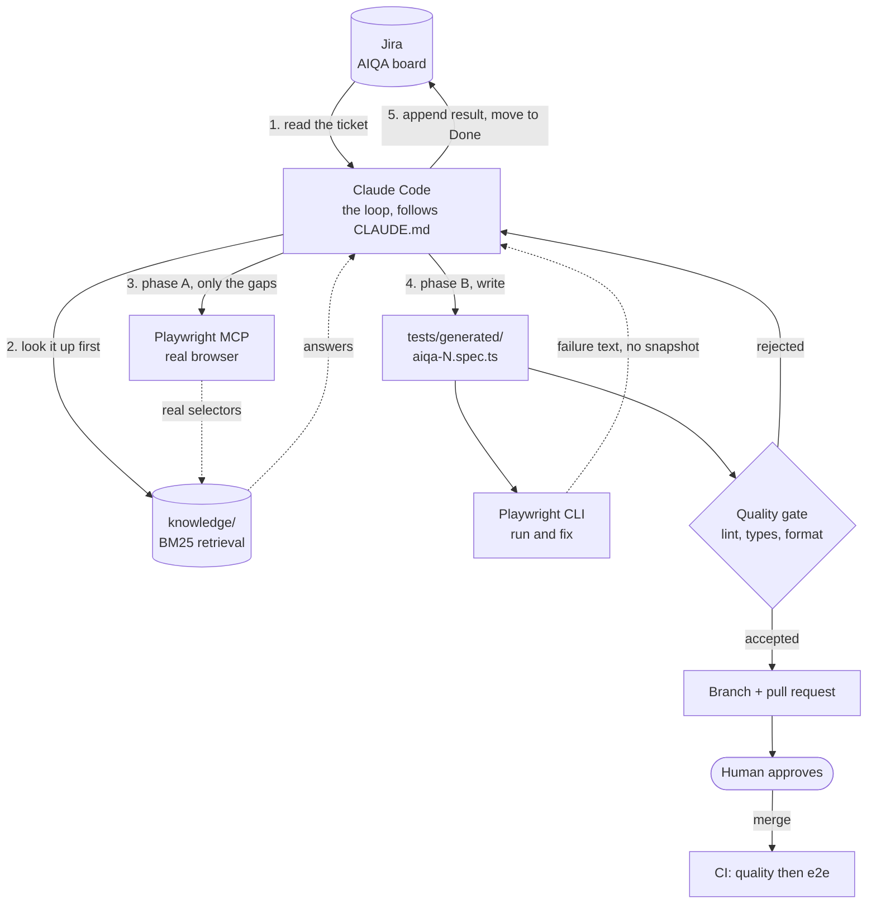

# AI QA Agent: Jira -> Playwright -> Jira

[](https://github.com/AlexandrAQA/jira-playwright-ai-agent/actions/workflows/tests.yml)
[](https://alexandraqa.github.io/jira-playwright-ai-agent/)

**A Jira ticket goes in. A passing Playwright test comes out, and the ticket closes itself.**



The agent reads a ticket, explores the real web app in a browser to find real selectors,
generates an end-to-end test in Playwright and TypeScript, runs it until it is green,
writes the result back to the ticket and moves it across the board. A human stays in the
loop for irreversible actions.

Target app under test: [SauceDemo](https://www.saucedemo.com).

## Why this is more than "an LLM writes tests"

- **Real selectors, not guesses.** The agent opens the actual page through Playwright MCP
  and reads the DOM, instead of inventing selectors from the wording of the ticket.
- **A human owns the irreversible steps.** Moving a ticket or writing to its description
  asks for confirmation in interactive runs; autonomous runs are opt-in per ticket.
- **Every generated test lands in CI.** Each push and pull request runs the whole suite on
  GitHub Actions, so a test the agent wrote yesterday keeps being verified today.
- **A green test still has to earn its place.** A dedicated quality gate rejects specs that
  pass while proving nothing, and CI runs it before a single browser is installed.
- **The cost is measured, not asserted.** Consulting a knowledge base first and keeping the
  browser out of the fix loop cut a ticket by **57% in tokens and half in wall clock**,
  measured by running the same tickets through both pipelines. See
  [what a run costs](#what-a-run-costs).

## Governance: the agent proposes, a human merges

The agent has no write access to `main`. What it produces is a branch and a pull request:

```bash
npm run pr -- AIQA-7
```

The branch is `agent/aiqa-7`, and only the files that ticket may legitimately have
touched are staged, so unrelated work in the tree cannot ride along. The pull request
body lists what the automation already verified and, separately, the three things a
reviewer has to judge because no linter can: whether the test covers what the ticket
asked for, whether it would actually fail if the feature broke, and whether any new
knowledge-base entry is true rather than a guess that happened to work. Those boxes ship
unchecked, and the playbook forbids the agent from ticking them.

So "how do you stop the agent breaking your repository" has a mechanical answer. Three
things sit between a generated test and `main`: the quality gate rejects it locally, CI
runs it again on the pull request, and a person clicks merge.

## Quality gates

When the code is written by an agent, refactoring once solves nothing: the next run
reproduces the old habits. So each standard is enforced in three places at once.

| Where                             | What it does                                                                                |
| --------------------------------- | ------------------------------------------------------------------------------------------- |
| `CLAUDE.md`                       | Tells the agent the rules up front: page objects, fixtures, real selectors, no fixed sleeps |
| `scripts/lint-generated-tests.ts` | Rejects a spec that breaks them, even when the spec is green                                |
| `.github/workflows/tests.yml`     | Runs the gate, ESLint, Prettier and `tsc` before the tests, so violations fail in seconds   |

The custom gate covers what a general linter cannot express: a spec with no assertion, a
spec that jumps straight to a URL instead of clicking through the app, a hardcoded
credential, a brittle CSS or XPath selector, a copy-pasted login, a missing `test.step`.

On its first run it found ten such problems in tests that were already passing.

Alongside it, the usual toolchain: ESLint 9 with `typescript-eslint` type-aware rules
(a missing `await` on a locator is an error, not a warning), `eslint-plugin-playwright`,
Prettier, `tsc --noEmit`, `npm audit`, Dependabot, and a husky pre-commit hook so the
fast checks run before a commit exists.

## Retrieval: the agent looks it up before it opens a browser

Opening the app through Playwright MCP is the expensive part of a run. Every call adds an
accessibility snapshot to the context and that snapshot stays there, so ten calls cost ten
snapshots. Rediscovering the same selectors on every ticket is the single largest waste in
a naive agent loop.

So the project keeps a knowledge base in `knowledge/`: plain Markdown, one `##` section
per question, holding the selectors and page behaviour that earlier tickets established.
The agent queries it first and only explores the gaps.

```bash
npm run kb search "how do I assert the cart is empty"
```

Markdown rather than a vector store is a deliberate choice at this size: it diffs in a
pull request, a human can fix a wrong selector by editing one line, and the agent appends
to it with the tools it already has.

Retrieval runs on **local sentence embeddings** (all-MiniLM-L6-v2 through
transformers.js), with a **BM25** implementation in `src/knowledge.ts` as the baseline and
the fallback. No API key, no text leaving the machine.

### Which retriever, and why that one

The obvious answer is "hybrid, fuse both". It was built, measured, and it lost.
`npm run kb:eval` scores all three against 25 queries in two suites: one paraphrased into
everyday words, one written in exact tokens the way an agent quotes a ticket.

| Retrieval              | recall@3 | MRR   |
| ---------------------- | -------- | ----- |
| BM25 only              | 64%      | 0.593 |
| **Embeddings only**    | **84%**  | 0.780 |
| Hybrid (fused on rank) | 80%      | 0.673 |

The split behind those totals is the interesting part. On exact tokens BM25 is perfect and
embeddings are not: 100% against 80% at rank one. On paraphrases it inverts hard, 40%
against 73%. Fusing them should capture both, and it does not, because on a paraphrased
question BM25 does not merely rank worse, it votes confidently for wrong sections and
displaces correct ones.

Weighting the fusion towards the vectors was tried across weights 1 to 10. The curve came
back 76, 80, 80, 80, 76, 84, which is the shape of fitting noise on 25 queries rather than
of a real gain. So the simpler thing ships. The harness stays, because a bigger corpus
gives exact matching more to work with and the answer may flip.

### How it stays cheap and installable

Chunk vectors are built once by `npm run kb:index` and committed as 91 KB of JSON, so the
repository carries semantic retrieval without every checkout needing a native ONNX
runtime. `@huggingface/transformers` is an **optional** dependency loaded dynamically: it
pulls `onnxruntime-node` and `sharp`, which carry high-severity advisories with no fix
available, so CI installs with `--omit=optional` and that code is simply not present
there. Retrieval degrades to BM25 rather than failing, and the CLI prints which retriever
actually ran, because a silent fallback is how you spend an afternoon debugging retrieval
quality that was never the problem.

`tests/unit/knowledge.spec.ts` and `tests/unit/retrieval.spec.ts` pin the ranking and the
fallback with vectors injected by hand, so none of it needs the model to run in CI.

## Cost discipline: three sources, in order

`CLAUDE.md` makes the agent reach for the cheapest source that can answer a question.

| Source                             | Cost                               | Used for                 |
| ---------------------------------- | ---------------------------------- | ------------------------ |
| Knowledge base (`scripts/kb.ts`)   | a few hundred tokens               | anything already learned |
| Playwright CLI (`playwright test`) | one error message                  | the write, run, fix loop |
| Playwright MCP (`browser_*`)       | an accessibility snapshot per call | first-time recon only    |

The run is split into two phases with a hard boundary. **Phase A** is recon through MCP,
entered only for what the knowledge base did not answer, and left as soon as the selectors
are in hand. **Phase B** is writing and fixing through the CLI, and it never reopens the
browser: a failing assertion is diagnosed from the error text, not from another snapshot.

## What a run costs

Every measured run appends a line to `metrics/runs.jsonl`, and the table below is
generated from that file by `npm run metrics -- --write`. No number here is typed by
hand, so none of them can drift away from the data.

<!-- metrics:start -->

| Strategy   | Runs | Avg tokens | Avg cost, USD | Avg turns | Avg duration |
| ---------- | ---- | ---------- | ------------- | --------- | ------------ |
| `mcp-only` | 2    | 2,242,279  | 0.3384        | 43.0      | 224.6s       |
| `kb-first` | 2    | 965,029    | 0.1618        | 23.0      | 109.0s       |

`kb-first` uses 57% fewer tokens per ticket than `mcp-only`, measured over 2 and 2 runs.

<!-- metrics:end -->

```bash
npm run agent -- AIQA-7                        # measured run, current pipeline
npm run agent -- AIQA-7 --strategy mcp-only    # measured run, original pipeline
npm run agent -- AIQA-7 --dry-run              # print the command, record nothing
npm run metrics -- --write                     # regenerate the table above
```

`mcp-only` re-runs the original loop on purpose, exploring every selector through the
browser, so the comparison is between two pipelines that both actually ran rather than
between a pipeline and a recollection of one.

One caveat worth stating rather than hiding: the knowledge base already covers the pages
these tickets touch, so the measured gap is the steady state, what a ticket costs once the
app is known. It is not what the very first ticket against an unfamiliar app costs, and
the gap there is smaller, because that run has to do the recon either way.

## Architecture



The dashed arrows are the cheap paths. The solid one into Playwright MCP is the expensive
one, which is why it is entered only for what the knowledge base could not answer, and why
what MCP learns goes back into the knowledge base instead of being discovered again.

| Role         | Component      | Responsibility                                           |
| ------------ | -------------- | -------------------------------------------------------- |
| Brain + loop | Claude Code    | Decides, writes test code, runs the workflow             |
| Instructions | `CLAUDE.md`    | The playbook: workflow steps and rules                   |
| Hands + eyes | Playwright MCP | Drives a real browser, inspects the DOM, finds selectors |
| Door to Jira | `src/jira.ts`  | Thin REST v3 client: read / move / append                |
| Secrets      | `.env`         | Jira credentials and SauceDemo test logins               |

MCP (Model Context Protocol) is an open standard for connecting tools and data to a
model. Playwright MCP is what makes the agent reliable: instead of guessing selectors
from the ticket text, it opens the real page and picks real selectors.

## Workflow ("pick up aiqa N")

1. Read the ticket from Jira (`src/jira.ts get`).
2. Move it to **In Progress**.
3. Query the knowledge base for what the ticket needs (`scripts/kb.ts search`).
4. **Phase A:** explore SauceDemo via Playwright MCP, but only for the gaps the knowledge
   base did not fill. Skipped entirely when there were none.
5. **Phase B:** generate `tests/generated/aiqa-N.spec.ts` (each ticket step is a `test.step`).
6. Run with the Playwright CLI and fix until green, without reopening the browser.
7. Pass the quality gates (custom gate, ESLint, Prettier, types).
8. Append anything newly discovered to `knowledge/`, so the next ticket is cheaper.
9. Append the result to the ticket description.
10. Move it to **Done**.

## Tech stack

- Playwright + TypeScript (Chromium, page objects and fixtures, html + json + JUnit reporters,
  traces, screenshots and video retained on failure)
- Playwright MCP (browser control)
- axios + dotenv (Jira REST API v3 client, typed at the boundary)
- ESLint 9 flat config + typescript-eslint (type-aware) + eslint-plugin-playwright + Prettier
- GitHub Actions, husky + lint-staged, Dependabot
- Claude Code as the agent runtime

## Setup

```bash
npm install
npx playwright install chromium
cp .env.example .env   # then fill in your Jira values
```

The Playwright MCP server is already declared in `.mcp.json` (it points to
`playwright-mcp.config.json` for the browser launch flags), so Claude Code picks it up
automatically when you open this folder.

Required `.env` values: `JIRA_BASE_URL`, `JIRA_EMAIL`, `JIRA_API_TOKEN`, `JIRA_PROJECT_KEY`.
Create the API token at `id.atlassian.com -> Security -> Create API token`.

## Usage

```bash
# Jira helper (CLI)
npx tsx src/jira.ts get AIQA-1
npx tsx src/jira.ts move AIQA-1 "In Progress"
npx tsx src/jira.ts append AIQA-1 "Automated and passing."

# Knowledge base
npm run kb search "which selector is the login button"
npm run kb list

# Run tests
npm test          # everything
npm run test:unit # retrieval unit tests, no browser
npm run test:e2e  # the browser suite
npm run report    # open the HTML report

# Quality gates (the same ones CI runs)
npm run lint:tests    # custom gate for agent-generated specs
npm run lint          # ESLint, type-aware
npm run format:check  # Prettier
npm run typecheck     # tsc --noEmit
```

Then, inside Claude Code in this folder, just say `pick up aiqa 1`.

## Label-triggered autonomous mode

Instead of running each ticket by hand, a polling watcher picks up tickets automatically.
Add the label `playwright_agent` to a Jira ticket and the agent runs the whole flow on its own.

```bash
# add the trigger label to a ticket
npx tsx src/jira.ts label-add AIQA-2 playwright_agent

# safe dry run (detects labeled tickets, prints the command, runs nothing)
WATCH_DRY_RUN=1 WATCH_ONESHOT=1 npx tsx scripts/watch-jira.ts

# start the watcher (polls Jira, runs the agent on each new labeled ticket)
npx tsx scripts/watch-jira.ts
```

`scripts/watch-jira.ts` polls Jira with
`project = AIQA AND labels = playwright_agent AND status = "To Do"` and, for each new ticket,
runs the agent headless:

```bash
claude -p "pick up AIQA-N ..." --model haiku --permission-mode bypassPermissions \
  --mcp-config .mcp.json --strict-mcp-config
```

Configurable via env: `WATCH_MODEL` (`haiku` | `sonnet` | `opus`), `WATCH_INTERVAL_MS`, `WATCH_LABEL`.
This is the polling variant of the trigger; a Jira webhook would be the event-driven alternative.

## Project structure

```text
.mcp.json                    Playwright MCP server definition
playwright-mcp.config.json   browser launch flags for the MCP server
.env / .env.example          secrets (env) and template
playwright.config.ts         Playwright config (chromium, reporters, baseURL)
eslint.config.mjs            ESLint flat config (type-aware + Playwright rules)
CLAUDE.md                    agent playbook (read automatically by Claude Code)
knowledge/                   the knowledge base: Markdown, one section per question
src/jira.ts                  Jira REST v3 helper + CLI
src/knowledge.ts             BM25 retrieval over knowledge/
src/metrics.ts               per-run cost bookkeeping (JSONL + aggregation)
src/github.ts                remote parsing and pull-request body
src/claude-cli.ts            locates the Claude Code executable to spawn
scripts/kb.ts                CLI for the knowledge base (search, list)
scripts/run-agent.ts         measured agent run, appends to metrics/runs.jsonl
scripts/open-pr.ts           branch + pull request for one ticket
scripts/reset-ticket.ts      put a ticket back to To Do so a run can be repeated
scripts/metrics-report.ts    regenerates the cost table in this README
scripts/seed-tickets.ts      one-off: seed ticket descriptions
scripts/watch-jira.ts        polling trigger (label-based autonomous runs)
scripts/lint-generated-tests.ts  quality gate for agent-generated specs
scripts/summarize-failures.ts    turns the JSON report into a short failure digest
tests/support/pages/         page objects
tests/support/fixtures.ts    Playwright fixtures (page objects + logged-in state)
tests/generated/             generated Playwright specs
tests/unit/                  unit tests for the retriever (no browser)
.github/workflows/tests.yml  CI: quality job, then the e2e job
.github/dependabot.yml       weekly dependency updates
```

## Notes

This is the lightweight variant: Claude Code as the agent, a hand-written Jira REST
client, manual trigger. It evolves naturally toward a production setup (custom agent
loop on the Anthropic SDK, Jira via MCP, label-based trigger, CI, human-in-the-loop).
